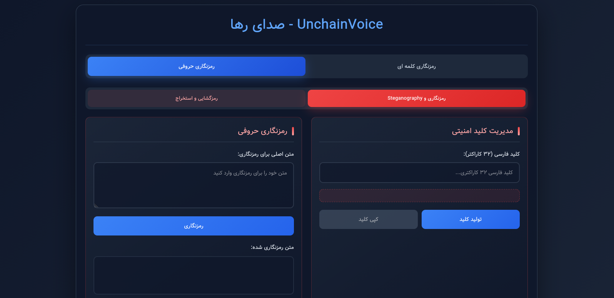
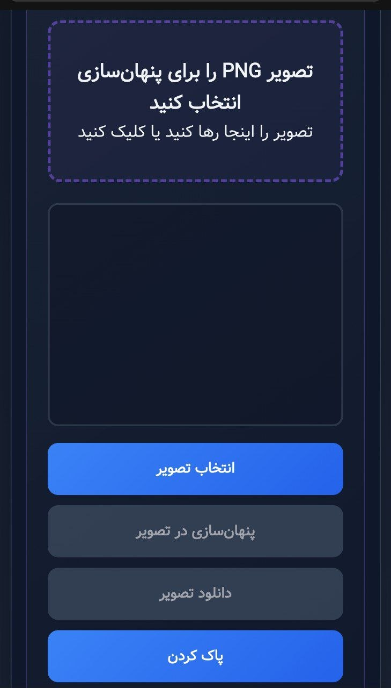
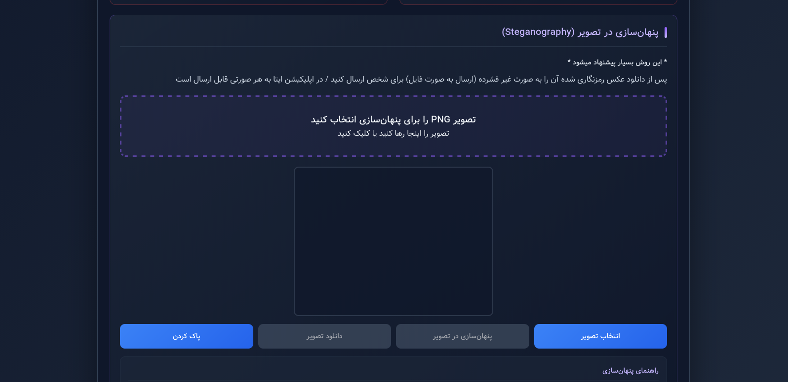

<p align="center">
  <a href="https://friauche.github.io/UnchainVoice">
    
  </a>
</p>

<h1 align="center">رمزنگار فارسی پیشرفته</h1>

<p align="center">
  <strong>ابزار رمزنگاری و استگانوگرافی فارسی</strong>
</p>

<p align="center">
  <a href="https://friauche.github.io/UnchainVoice">
    
  </a>
  <a href="https://github.com/friauche/UnchainVoice">
    
  </a>
  <a href="https://github.com/friauche/UnchainVoice/blob/main/LICENSE">
    
  </a>
</p>

## ✨ ویژگی‌ها
- رمزنگاری کلمه‌ای فارسی
- بسیار امن
- رمزنگاری حروفی فارسی  
- پنهان‌سازی در تصویر (استگانوگرافی)
- نصب وب اپلیکیشن و کارکرد آفلاین

  ---

## 🖼️ اسکرین‌شات
<details>
<summary>
  <span style="display: inline-block; transition: transform 0.3s;">▶️</span>
  گالری تصاویر پروژه
</summary>

<div align="center">

| رمزنگاری کلمه ای | رمزنگاری کلمه ای |
|-----------|-------------|
|  |  |
| *حالت موبایل* | *حالت کامپیوتر* |

| رمزنگاری حروفی | رمزنگاری حروفی |
|-----------|---------|
|  |  |
| *حالت موبایل* | *حالت کامپیوتر* |

| استگانوگرافی | استگانوگرافی |
|-----------|---------|
|  |  |
| *حالت موبایل* | *حالت کامپیوتر* |


</div>

<div align="center" style="margin-top: 20px;">
</div>
</details></br>

---


## 🔐 انواع رمزنگاری
### ✏️ رمزنگاری با کلمات
**✅ مزایا:**
- طبیعی به نظر میرسد
- تشخیص رمز بودنش سخت است
- مناسب برای پیام های متنی کوتاه

**❌ معایب:**
- حجم زیاد
- کلمات فارسی محدود
- 
**مثال:**
```
کلید: بزرگ زر فار جمع حلقه جو پدر خر

متن: ایران

متن رمزنگاری شده: آبش شو آقا پاک بانو خاک خرد رج بس عاقبت دور آینه صفت حلال فار الفت او پل راه پشت تپش باز دور ریشه زد انجیر شر آفتاب آذر این بانو است عین صر شب جمع از غم
```

---

### ✏️ رمزنگاری با حروف
**✅ مزایا:**
- حجم کمتر
- کاراکتر های متنوع
- مناسب برای داده های باینری
- امکان پنهان سازی 

**❌ معایب:**
- ظاهری غیر طبیعی

**مثال:**
```
کلید: لسدگحمکقناجفگکیجمغعطدشاتشعهچظسلت

متن: ایران

متن رمزنگاری شده:
ع2جsوچغؤق19ظلپق/اضz3وخفصء3یqحyإoطpszإpگگyخ0=
```

---


## 🥷 استگانوگرافی (پیشنهادی)
**✅ مزایا:**
- کاملا پنهان
- حجم و کیفیت عکس تغییری نمیکند
- مناسب برای هر نوع پیامی

**❌ معایب:**
- امکان فشرده سازی تصویر وجود ندارد


**⚠️ نکات مهم**
- عکس با محتوای پنهان را در پیام رسان ها به صورت غیر فشرده(فایل) ارسال کنید


---

## 🔗 دمو
[مشاهده دمو](https://Friauche.github.io/UnchainVoice)

---


## 📧 ارتباط

**[ُTelegram](https://t.me/mainـcoordinate)**
**[ُTwitter](https://x.com/MrFriauche)**
</br>
<div style="text-align=center;">
به امید روز های بهتر 🇮🇷
</div>

