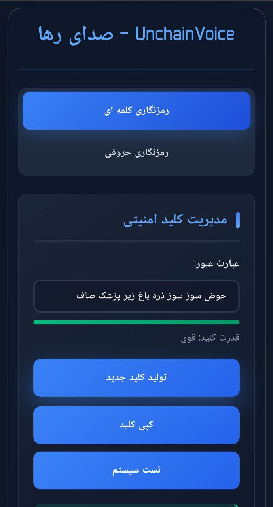
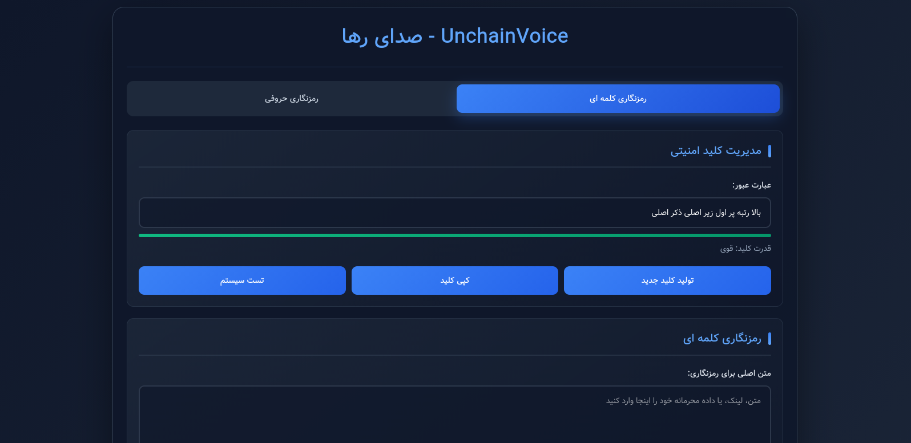

  

<h1 align="center">رمزنگار فارسی پیشرفته</h1>

  <strong>ابزار رمزنگاری و استگانوگرافی فارسی</strong>

  
  
  

## ✨ ویژگی‌ها
- رمزنگاری کلمه‌ای فارسی
- بسیار امن
- رمزنگاری حروفی فارسی  
- پنهان‌سازی در تصویر (استگانوگرافی)
- نصب وب اپلیکیشن و کارکرد آفلاین

  ---

## 🖼️ اسکرین‌شات

  ▶️
  گالری تصاویر پروژه

| رمزنگاری کلمه ای | رمزنگاری کلمه ای |
|-----------|-------------|
|  |  |

